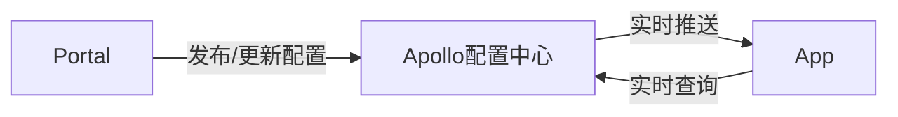

https://www.jianshu.com/p/f0a1b00a6002
https://www.jdon.com/42886
https://www.jdon.com/46956
https://blog.csdn.net/mcb520wf/article/details/82622315
https://blog.csdn.net/mcb520wf/article/details/82585443
https://blog.csdn.net/mcb520wf/article/details/82456456
https://www.cnblogs.com/aspirant/p/5697807.html
https://baijiahao.baidu.com/s?id=1614113645362681785&wfr=spider&for=pc
https://blog.csdn.net/chenyulancn/article/details/79373286
https://blog.csdn.net/zhengchao1991/article/details/81071725
https://www.cnblogs.com/zhongshiqiang/p/6092409.html
https://www.yiibai.com/nodejs/nodejs-quick-start.html
https://community.risingstack.com/opencv-tutorial-computer-vision-with-node-js/
https://segmentfault.com/a/1190000009650938

